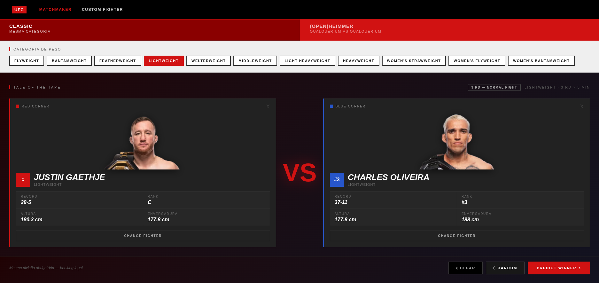
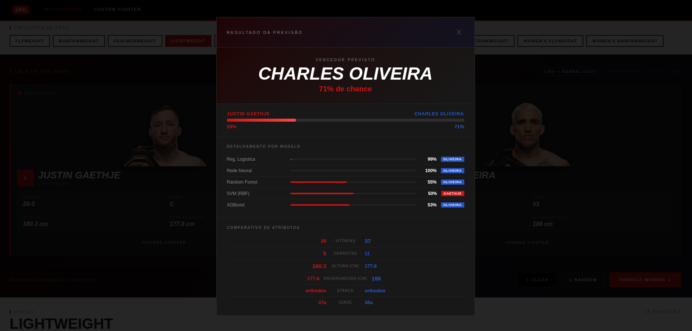
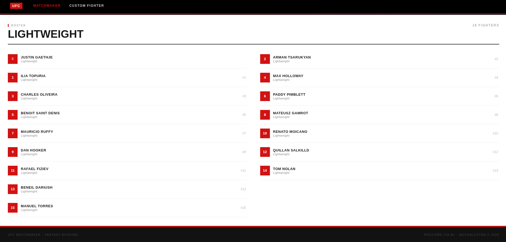

# MuchaLutcha — UFC Fight Predictor

Projeto final da disciplina **Aprendizagem de Máquina (2026.1)** — Departamento de Computação, UFC.  
Prof. César Lincoln C. Mattos.

Previsão do vencedor de lutas do UFC como **classificação binária**, comparando cinco modelos de ML sobre **9.479 lutas reais (1993–2026)**. Inclui um web app com scraping ao vivo dos rankings oficiais da UFC e confrontos livres entre qualquer categoria de peso.

---

## Resultados

| Modelo | AUC-ROC (CV) |
|---|---|
| **Regressão Logística** | **0,637** |
| XGBoost | 0,635 |
| Random Forest | 0,629 |
| Rede Neural (MLP) | 0,624 |
| SVM (RBF) | 0,622 |
| Baseline (classe majoritária) | ~0,500 |

---

## Como a previsão é calculada

### 1. Dados de entrada

O modelo nunca vê os dois lutadores separadamente. Ele recebe um **vetor diferencial**: para cada atributo, calcula-se `valor_do_lutador − valor_do_oponente`. Isso torna a representação antissimétrica — inverter os dois lutadores inverte o sinal de todas as features e o alvo — e elimina viés de canto (vermelho vs azul).

```
Exemplo: Islam Makhachev (27W-3L) vs Charles Oliveira (35W-10L)

d_vitorias     = 27 − 35 = −8
d_derrotas     = 3  − 10 = −7   ← menos derrotas → favorece Makhachev
d_L5Y_winrate  = 1.0 − 0.75 = +0.25
d_sig_strikes_absorbed = 3.1 − 5.9 = −2.8  ← absorve menos → favorece Makhachev
...
```

### 2. Os 23 atributos diferenciais

| Grupo | Atributos | Sinal esperado |
|---|---|---|
| **Cartel** | `d_vitorias`, `d_derrotas`, `d_lutas_totais` | + vitórias, − derrotas favorecem |
| **Método de vitória** | `d_taxa_ko`, `d_taxa_sub`, `d_taxa_dec` | dependente do estilo |
| **Chin / Resistência** | `d_ko_losses`, `d_dec_rate_overall` | menos KO losses e mais decisões favorecem |
| **Forma recente** | `d_L5Y_winrate`, `d_L2Y_winrate` | + winrate recente favorece |
| **Striking** | `d_sig_strikes_landed`, `d_sig_strikes_absorbed`, `d_sig_strike_acc` | mais acertos e menos absorvidos favorecem |
| **Wrestling** | `d_td_landed`, `d_td_acc` | mais takedowns favorecem |
| **Físico** | `d_idade`, `d_altura`, `d_envergadura` | envergadura e altura favorecem |
| **Stance** | `d_stance_orthodox/southpaw/switch/other`, `estilos_diferentes` | southpaw leve vantagem |

### 3. Os cinco modelos

Cada modelo recebe o mesmo vetor de 23 features e retorna uma probabilidade entre 0 e 1:

| Modelo | Como funciona |
|---|---|
| **Regressão Logística** | Combinação linear das features com pesos aprendidos. Transparente e rápida. Melhor AUC do ensemble. |
| **Random Forest** | Conjunto de 100+ árvores de decisão. Cada árvore vota; maioria decide. Robusto a outliers. |
| **XGBoost** | Gradient boosting: árvores construídas sequencialmente, cada uma corrigindo os erros da anterior. |
| **SVM (RBF)** | Separa os exemplos no espaço de features usando um hiperplano de margem máxima com kernel radial. |
| **Rede Neural (MLP)** | Duas camadas ocultas de 32 neurônios cada, com ativação ReLU. Captura interações não-lineares. |

### 4. Ensemble

A probabilidade final é a **média simples** das cinco probabilidades:

```
P(lutador A vence) = média(logreg, rf, xgboost, svm, mlp)
```

O lutador com P > 50% é declarado vencedor previsto.

### 5. Pesos aprendidos (Regressão Logística)

Os coeficientes abaixo mostram o que o modelo considera mais importante. Um coeficiente positivo favorece o lutador A; negativo favorece o oponente:

| Feature | Coef. | Interpretação |
|---|---|---|
| `d_idade` | −0,315 | **Mais velho tende a perder** (artefato de fim de carreira no dataset) |
| `d_sig_strikes_absorbed` | −0,221 | Absorver mais golpes é sinal forte de derrota |
| `d_L5Y_winrate` | +0,148 | Forma nos últimos 5 anos é o melhor preditor positivo |
| `d_vitorias` | +0,146 | Cartel total importa, mas menos que forma recente |
| `d_td_landed` | +0,140 | Wrestling é relevante |
| `d_sig_strike_acc` | +0,130 | Precisão no striking favorece |
| `d_sig_strikes_landed` | +0,126 | Volume ofensivo favorece |
| `d_derrotas` | −0,091 | Mais derrotas no histórico desfavorece |

### 6. Ajuste para lutas de título (5 rounds)

Em lutas de 5 rounds, o atributo `d_dec_rate_overall` é multiplicado por **3×** antes da inferência:

```python
# dec_rate_overall = % de todas as lutas (W+L) que foram a decisão
# Proxy de resistência aeróbica e capacidade de manter o ritmo nos rounds finais
if title_fight:
    X[d_dec_rate_overall] *= 3.0
```

Isso amplifica a vantagem de fighters que historicamente vão a decisão — indicativo de que aguentam o ritmo de lutas longas.

### 7. Split temporal e treinamento

O dataset é dividido **cronologicamente** (não aleatoriamente) para simular uso real:

```
Treino: 80% das lutas mais antigas  → 13.634 amostras (espelhadas) · 2008–2024
Teste:  20% das lutas mais recentes → 1.705 amostras               · 2024–2026
```

O espelhamento consiste em duplicar cada luta trocando lutador/oponente e invertendo o alvo — isso dobra o dataset e garante que o modelo não aprenda viés de posição.

Hiperparâmetros são selecionados por `GridSearchCV` com 5-fold estratificado no conjunto de treino usando AUC-ROC como métrica. O conjunto de teste nunca é tocado durante a seleção.

<!-- IMAGENS: adicione abaixo -->
<!--  -->
<!--  -->
<!--  -->
<!--  -->

---

## Web App

Interface completa para simular confrontos entre lutadores reais ou criados pelo usuário.


- **Classic mode** — seleciona lutadores da divisão escolhida
- **(Open)heimmer mode** — qualquer lutador vs qualquer lutador, sem restrições de peso
- **Picker com filtro de divisão** — dropdown no picker permite escolher qualquer categoria na hora de montar cada corner, independente do modo
- **Custom Fighter** — crie um lutador fictício com stats completas e teste contra lutadores reais (menu superior direito)
- **Fotos dos atletas** — carregadas assincronamente da UFC.com
- **Title Fight toggle** — alterna 3 vs 5 rounds e ativa o boost de `dec_rate_overall`
- **Previsão em ensemble** — média dos 5 modelos com detalhamento por modelo e comparativo de atributos







---

## Estrutura

```
src/              pipeline de ML (data_prep → features → eda → train → evaluate)
data/raw/         CSVs de entrada (ufc_fights.csv, fighter_stats.csv)
data/processed/   dataset limpo + matrizes de treino/teste
results/          figuras, tabelas e modelos treinados (.joblib)
scripts/          utilitários (update_dataset.py — scraping de novos eventos)
web/              frontend do web app (index.html)
app.py            servidor Flask (API + web app)
predict.py        preditor interativo via terminal
```

---

## Opção 1 — Web App via Docker (recomendado)

> Requer [Docker](https://docs.docker.com/get-docker/) instalado.

### 1. Obter os dados brutos

```bash
git clone --depth=1 --filter=blob:none --sparse \
  https://github.com/leotuckey/Punch-Prophecy-Leo-Tuckey reference
cd reference
git sparse-checkout set src/models/buildingMLModel/data/processed/
cd ..
mkdir -p data/raw
cp reference/src/models/buildingMLModel/data/processed/ufc_fights.csv data/raw/
cp reference/src/models/buildingMLModel/data/processed/fighter_stats.csv data/raw/
```

### 2. Build e run

```bash
docker build -t muchalutcha .
docker run -p 5000:5000 muchalutcha
```

Abra **http://localhost:5000** no navegador.

> O container executa o pipeline completo (treino + avaliação) na primeira inicialização e depois sobe o servidor web. Se quiser pular o treino e usar modelos já treinados, monte o diretório `results/`:
> ```bash
> docker run -p 5000:5000 -v $(pwd)/results:/app/results muchalutcha
> ```

---

## Opção 2 — Rodar localmente

### 1. Dependências

```bash
pip install -r requirements.txt
pip install flask flask-cors requests beautifulsoup4 playwright
playwright install chromium
```

Ou com `uv`:

```bash
uv venv .venv
uv pip install -r requirements.txt
uv pip install flask flask-cors requests beautifulsoup4 playwright
playwright install chromium
```

### 2. Dados

```bash
git clone --depth=1 --filter=blob:none --sparse \
  https://github.com/leotuckey/Punch-Prophecy-Leo-Tuckey reference
cd reference && git sparse-checkout set src/models/buildingMLModel/data/processed/ && cd ..
mkdir -p data/raw
cp reference/src/models/buildingMLModel/data/processed/ufc_fights.csv data/raw/
cp reference/src/models/buildingMLModel/data/processed/fighter_stats.csv data/raw/
```

### 3. Treinar os modelos

```bash
cd src
python data_prep.py   # limpeza → data/processed/fights.csv
python features.py    # engenharia de features + split temporal
python train.py       # GridSearchCV nos 5 modelos (~5 min)
python evaluate.py    # métricas, figuras, tabelas
cd ..
```

Atalho:

```bash
bash run_all.sh       # Linux/macOS
pwsh ./run_all.ps1    # Windows PowerShell
```

### 4. Web App

```bash
python app.py
# → http://localhost:5000
```

### 5. Atualizar o dataset com eventos recentes (opcional)

O script `scripts/update_dataset.py` raspa automaticamente todos os eventos do ufcstats.com após o corte atual do dataset e adiciona as novas lutas ao CSV. Requer Playwright (Chromium) para contornar o Cloudflare.

```bash
python scripts/update_dataset.py
# Após o scraping, re-rodar o pipeline:
cd src && python data_prep.py && python features.py && python train.py && cd ..
```

Os stats de fighter do scraping são extraídos da página atual de cada atleta no ufcstats.com (vitórias/derrotas, físico, médias de carreira). Os resultados são cacheados em `data/raw/fighter_cache.json` para reutilização em futuras execuções.

### 6. Preditor via terminal (opcional)

```bash
# Demo com 10 lutas históricas reais
python predict.py --demo

# Confronto direto
python predict.py --fight "Jon Jones" "Tom Aspinall"

# Modo interativo
python predict.py
```

---

## Decisões metodológicas

- **Representação diferencial** (lutador − oponente): antissimétrica, permite espelhar cada luta no treino para balancear classes e eliminar viés de canto.
- **Split temporal** (80% antigas / 20% recentes): evita vazamento de dados e simula uso real — treina no passado, testa no futuro. O conjunto de teste cobre 2024–2026.
- **Atributos físicos** preferidos do `fighter_stats.csv` (cobertura ~99,3%); ausentes imputados pela mediana.
- **Seleção de hiperparâmetros** por `GridSearchCV` com 5-fold estratificado, métrica AUC, apenas no conjunto de treino.
- **Boost de título fight**: em lutas de 5 rounds, o atributo `d_dec_rate_overall` é multiplicado por 3× na inferência, favorecendo fighters com histórico de ir a decisão — proxy de resistência aeróbica.
- **Scraping com Playwright**: ufcstats.com usa Cloudflare com desafio JavaScript; requisições simples (curl/requests) retornam página de bloqueio. O Playwright executa um browser Chromium headless que resolve o desafio automaticamente.
- **Semente fixa** `SEMENTE = 42` em `src/config.py` para reprodutibilidade total.
